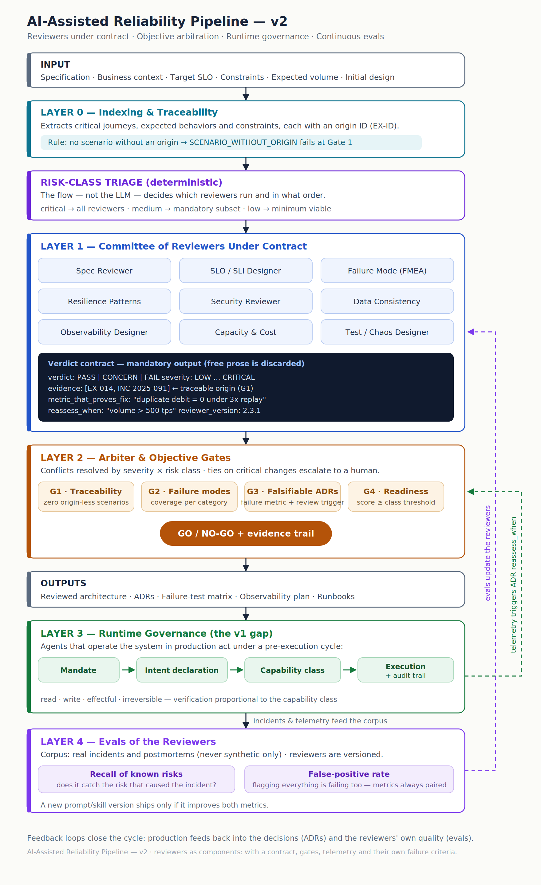

# Continuous Architecture Assurance (CAA)

> A pluggable assurance layer for technical decisions. It does not produce another framework for judging architecture — it provides the mechanism that **calibrates** the frameworks you already use, and proves, against real incidents, whether they measure what they claim to measure.

**Status:** Position paper + reference specification + pre-registered falsification experiment. This is an architecture and a hypothesis, not yet a validated result. The central efficacy claim is testable and the test is included in this repo (see [`/experiments`](./experiments)).

**Author:** Rudson Carvalho · Independent research
**License:** see [LICENSE](./LICENSE) (Apache-2.0 for code, CC BY 4.0 for docs/spec — adjust as you prefer)

---

## The one-line pitch

Everyone is building rulers to evaluate architecture — well-architected frameworks, maturity models, checklists, and now AI reviewers. **CAA is the machine that calibrates the rulers.**

## The problem

As AI reviewers enter the software design loop, the standard pattern is a swarm of specialized "reviewers" (security, data, capacity…) that each emit pages of feedback before you ship. In practice this becomes **checklist theater**: free-form prose nobody arbitrates, built on scenarios the model may have invented, with the reviewers treated as oracles.

Nobody answers the obvious question: **who checks that the reviewer is any good?**

The adjacent fields each leave this gap open:

- **Dynamic assurance cases** (aviation, automotive, medical) are mature but locked to safety-critical domains and largely manual to author and maintain.
- **LLMs generating assurance cases** (2024–2025) treat the model as the *author* of the case, not as an instrument that is itself validated.
- **AI-driven architecture governance** (industry / EA) is mostly aspirational: continuous-governance vision without assurance-case semantics, traceability rules, or meta-evaluation of the reviewers.

CAA targets the empty intersection: assurance-case rigor, applied to mainstream distributed systems, with AI reviewers as **calibrated instruments** rather than oracles.

## The core idea

A reliability pipeline produces exactly one thing of value: **justified confidence with known coverage.** Not "it won't fail" — but "here is what we claimed, the evidence for each claim, and the risk we knowingly accepted."

CAA treats this as a **metrology problem**:

| Metrology concept | CAA equivalent |
|---|---|
| The instrument | An AI reviewer (or any "ruler": well-architected, maturity model, checklist) |
| Calibration against a reference standard | Recall + false-positive rate against a corpus of **real incidents** |
| Measurement uncertainty | Explicit residual risk (what was not claimed or tested) |
| Metrological traceability | Every finding cites a traceable origin (EX-ID / incident) |
| Chain of custody | The verdict contract + audit trail |

The product is **not** the ten reviewers. The product is the **contract**: the verdict schema, the origin rule, the four gates, and the paired calibration metrics. Reviewers, models, and even the production substrate (an agentic SDLC, a software factory, a human team) are substitutable implementations behind that interface.

## Two planes, one principle

CAA separates a **production plane** (whatever produces code, decisions, deploys) from an **assurance plane** (which consumes claims + evidence and emits auditable confidence). The non-negotiable principle is **independence**: the party that assures cannot be the party that produces. A pipeline's own internal reviewers and gates are part of production; CAA audits *them too*. This mirrors internal controls vs. independent audit in banking — the first does not replace the second.

## The pipeline (v2)



**Layer 0 — Indexing & Traceability.** Spec, business context and target SLO are indexed; every journey and constraint gets an origin ID (EX-ID). Rule: *no scenario without an origin* → `SCENARIO_WITHOUT_ORIGIN` auto-fails at Gate 1. This kills "plausible noise" — invented risks that look like rigor but can't be audited later.

**Risk-class triage (deterministic).** The flow — not the LLM — decides which reviewers run and in what order. Critical change → all reviewers; low-risk → minimum viable. Fixes both the cost of over-reviewing and the risk of the model "forgetting" a mandatory check.

**Layer 1 — Reviewers under contract.** The familiar reviewers (Spec, SLO/SLI, FMEA, Resilience, Security, Data Consistency, Observability, Capacity & Cost, Test/Chaos) may emit **only** a structured verdict; free prose is discarded. Three fields carry the weight: `evidence` (traceable origin or it doesn't count), `metric_that_proves_fix` (no metric → no closed finding → no decorative architecture), `reassess_when` (turns each decision into a falsifiable hypothesis). See [`spec/verdict-contract.schema.json`](./spec/verdict-contract.schema.json).

**Layer 2 — Arbiter & objective gates.** Conflicts resolved by severity × risk class; ties on critical changes escalate to a human. Four gates: G1 traceability, G2 failure-mode coverage, G3 falsifiable ADRs, G4 production readiness. Output: **GO / NO-GO with a full evidence trail.**

**Layer 3 — Runtime governance.** Production agents act under a pre-execution cycle: **Mandate → Intent declaration → Capability class (read/write/effectful/irreversible) → Execution + audit trail.** Telemetry feeds backward: incidents become eval data; production metrics trip the `reassess_when` conditions of past decisions.

**Layer 4 — Evals of the reviewers.** Reviewers are components, so they get a quality contract too. Corpus = **real incidents and postmortems** (never synthetic-only). Two metrics, always paired: **recall of known risks** and **false-positive rate**. The pairing is the point — either alone is gameable; together they expose both the lazy reviewer and the paranoid one. A new reviewer version ships only if it improves both.

## What is genuinely new here

The components are old (assurance cases since the 1990s, dynamic safety cases since ~2015, LLM reviewers everywhere). The **synthesis** is what is unoccupied:

1. Assurance-case semantics applied to mainstream distributed-systems reliability, not just safety-critical.
2. AI reviewers as **calibrated instruments** under contract, not as authors or oracles.
3. The verdict contract as a **pluggable interface** — ruler-agnostic by design.
4. **Evals of the reviewers** as a first-class citizen, with recall *and* false-positive rate as a mandatory pair.

## The honest caveat

The claim that the recall/false-positive pairing actually discriminates good reviewers from bad ones is a **hypothesis**, not a result. It is falsifiable, and the experiment to falsify it — paired real-incident corpus, four reviewer conditions including two degenerate controls, pre-registered decision criteria — is in [`/experiments`](./experiments). Until that runs, CAA is a well-formed proposal held to exactly the standard it imposes on everything else.

## Repository layout

```
.
├── README.md                         # this file
├── docs/
│   ├── papers/
│   │   ├── position-paper.md         # CAA framework (genre: framework/position)
│   │   ├── empirical-study.md        # calibration metric, pre-registered falsification (genre: empirical)
│   │   └── meta-paper.md             # recursive gate-failure finding (genre: meta/reflective)
│   ├── diagrams/
│   │   ├── pipeline-v2.svg
│   │   └── gate-vs-auditor.svg/png   # closed-predicate gate vs. open-model auditor
│   ├── article.md                    # original position-paper draft (superseded by papers/position-paper.md)
│   ├── pipeline-v2-diagram.svg
│   └── pipeline-v2-diagram.png
├── spec/
│   └── verdict-contract.schema.json  # the pluggable interface (JSON Schema)
├── experiments/
│   ├── README.md
│   ├── calibration-protocol-ptbr.md  # falsification protocol
│   └── calib_experiment.py           # runnable skeleton (Anthropic API)
├── CITATION.cff
└── LICENSE
```

## The three papers

The work splits into three contributions of distinct genres — kept as separate papers because forcing one structure onto another makes a sound contribution look broken:

- **Position paper** (`docs/papers/position-paper.md`) — the CAA framework: AI reviewers as calibrated instruments, the verdict contract, the two-plane independence principle. Wrong if a simpler framing does the same work or the decomposition fails to cover a case it claims.
- **Empirical study** (`docs/papers/empirical-study.md`) — a pre-registered falsification of the paired recall/false-positive metric across two independent corpora with real model calls. Demonstrated: FP-axis discrimination of contracted vs. naive vs. two degenerate controls, replicated. Undemonstrated: recall-axis discrimination (recall saturates on textual cases, reproducibly). Untested: confident-misattribution detection (the control resisted three construction attempts).
- **Meta-paper** (`docs/papers/meta-paper.md`) — across five iterations an automated decision gate accepted a structurally defective result every time, and only independent human audit of raw data caught each one. Argued to be structural (a closed-predicate gate is complete only against anticipated failure), not an instance bug — a recursive demonstration of CAA's own independence premise.

**Status of all three: draft v0.1, target arXiv preprint. Not yet submitted; every numeric claim is reconstructed from raw per-call records independently of the experiment harness.**

## Contributing / discussion

This is an open proposal. Issues and discussion are welcome — especially counter-examples, prior art in the empty intersection above, and incident corpora that could harden Layer 4. If you find published work that already occupies this exact space, that is the most valuable contribution you can make.

## Related work

See [`docs/article.md`](./docs/article.md) for the full positioning against Dynamic Safety Cases (Denney & Pai), the Evidential Tool Bus, ACCESS, Assurance 2.0, and the 2024–2025 LLM-assurance-case literature.
